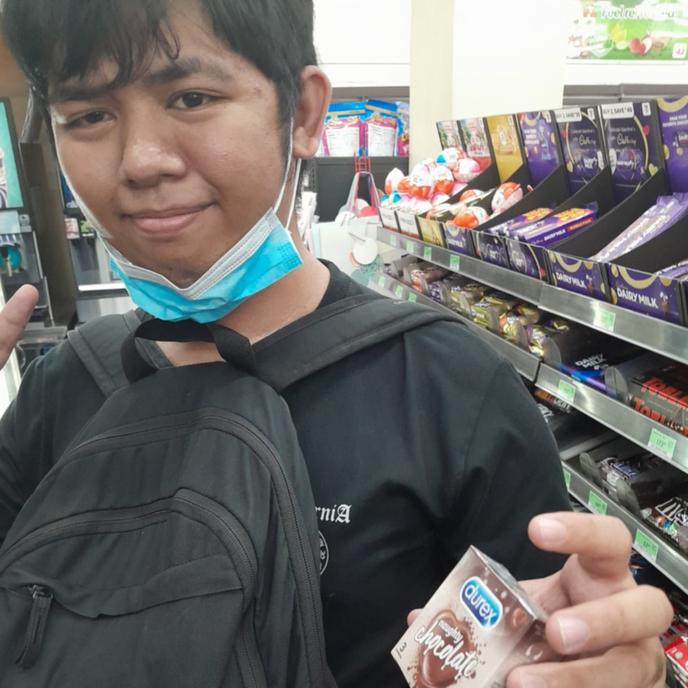

This was a project in Sts, a summary of our midterm to prefinal modules.
Quizzes were added as a reviewer but were ultimately never used.

## :sparkles: Credits:
- **Jekyll-themes Minimal Mistakes** - Used as the foundation for the project :star: :star:
- **Cabusora, Lyle Raphael** - Built first parts of website and added quizzes :star: :star: 
- **Pena, Neji Mat and Chavez, Jirah Jabes** - for the 03 Module :star: :star:
- **Briones, Johan Abunado and Mallari, Erehwon** - for the 04 Module :star: :star:
- **Altillo, Paul Cholo and Gornes, Kate Aileen** - for the 05 Module :star: :star:
- **Matira, Christian and Estabaya Emmanuel** - for the 06 Module :star: :star:
- **Sir Elemia, Rogelio** - for being a Great Teacher :heart: :heart:

  

